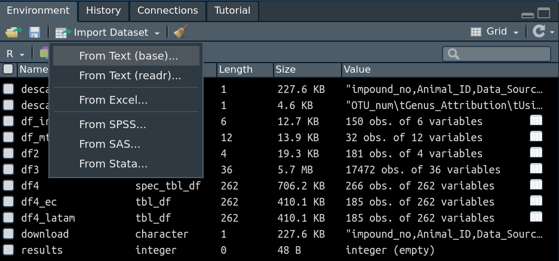
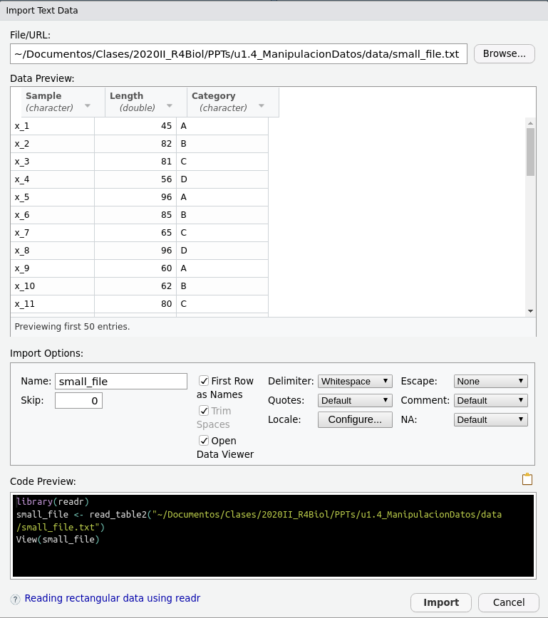

```{r warning=FALSE, message=FALSE,echo=FALSE}
rm(list=ls())         # borrar todo lo que haya en memoria
options(scipen=999)   # evitar notacion cientifica
options(encoding = "utf-8")

#Instalar librerias necesarias
# if(!require(knitr)){install.packages("knitr")}
# if(!require(readxl)){install.packages("readxl")}

library(knitr)

# Global options
 options(max.print="75")
 opts_chunk$set(message=FALSE,
                warning=FALSE)
  opts_knit$set(width=75)
```


Moisés Gualapuro - `moises.gualapuro@ikiam.edu.ec` - Universidad Regional Amazónica IKIAM, Tena (Ecuador)

Cristina Ramos - `cristina.ramos@ikiam.edu.ec` - Universidad Regional Amazónica IKIAM, Tena (Ecuador)

# CONTENIDO

# 1. Resultados de aprendizaje

Al finalizar la unidad, el estudiante será capaz de:

-   Utilizar paquetes en R

-   Leer archivos

-   Manipular datos

# 2. Utilizar paquetes en R

R viene con múltiples funciones pre-definidos, asimismo tiene paquetes pre-instalados. Sin embargo se tiene procesamientos que requieren funcionalidades adicionales. Estas funciones se desarrollan y almancenan repositorio de R denominada **CRAN** (<https://cloud.r-project.org/>). Para revisar el paquete disponible debe dirigirse a la sección "Software/Packages". Aquí encontrará un aproximado de 16395 paquetes.

## 2.1. Instalar paquetes

Para instalar alguno de ellos se debe usar el código:

```{r}
# Revisar paquetes instalados
installed.packages("forensic")

# Instalar un único paquete, install.packages("nombrepaquete")
#install.packages("forensic")

# Grupo de paquetes, install.packages(c("nombrepaquete1", "nombrepaquete2",...)) 
install.packages(c("tinytest", "abdiv"))

# Instalar solamente si se requiere
#if(require("forensic")) install.packages("forensic")

# Actualizar un paquete
update.packages("car")

# Remover o desinstalar paquete(s) 
remove.packages("abdiv")

```

## 2.2. Cargar paquetes

Para cargar los paquetes que han sido previamente instalados se debe usar la instrucción `library("nombre.paquete")`:


```{r}
# Para maniular datos, se requerirá "readr" y "tidyverse"
library("readr")
library("tidyverse")
library(dplyr)
```

# MANIPULACIÓN DE DATOS

Para manipular datos el "superpaquete" con mayor uso en R es `tidyverse`, cada uno de los paquetes que contiene tidyverse sirve en las etapas de análisis de datos, como se muestra en la siguiente figura:

```{r, out.width='80%', fig.align='center', fig.cap='FIGURA 1: Flujo de análisis de datos y paquetes de tidyverse utilizados en cada etapa'}
knitr::include_graphics('./img/tidyverse.png')
```

# 3. Leer e importar archivos

Para cargar archivos se recomienda primero definir el espacio de trabajo o `working directory`, para ello se requiere conocer en donde el `directorio`donde se está trabajando.

```{r}
# Conocer el directorio de trabajo 
getwd()

# Asignar otro directorio de trabajo
#setwd("/home/moisesgualapuro/Documentos/Clases/2020II_R4Biol/PPTs/nuevodir")
setwd("D:/GDrive2/My Drive/IKIAM/CLASES/2022II/7ProcesosIkiam/2022II_ClubProgramming/R4DS/ikiam_r4ds/manipulacion")
```

Teniendo el directorio de trabajo definido, podemos empezar a cargar data.

## 3.1. Generar data desde dataset precargada

```{r}
# Guardar data precargada de R como un archivo csv
data(iris)
write.csv(iris, "result/iris.csv")

dato <- read_csv("result/iris.csv")
head(dato, 1)
# str(dato)

```

## 3.2. Generar data desde dataset de un enlace url

```{r}
# Guardar data de un website como un archivo csv
library (RCurl)
descarga1 <- getURL("https://data.kingcounty.gov/api/views/yaai-7frk/rows.csv")
df2 <- read.csv (text = descarga1)
head(df2, 1)
# str(df2)

# Desde un archivo de github microbioma restauración
df2 <- read_tsv("https://raw.githubusercontent.com/geohouse/Plant-Microbiomes-in-Grassland-Restorations/master/taxonomicAttributionOfAMF_OTUs.tsv")
head(df2, 1)
# str(df2)

# Desde un archivo de github pajaros
df3 <- read_csv("https://raw.githubusercontent.com/inbo/bird-tracking/master/data/processed/BOP_RODENT/movebank_ref_data.csv")
head(df3, 1)

# Desde un archivo de github covid_global
df4 <- read_csv("https://raw.githubusercontent.com/CSSEGISandData/COVID-19/master/csse_covid_19_data/csse_covid_19_time_series/time_series_covid19_confirmed_global.csv")
head(df4, 1)

```

## 3.3. Importar data desde un directorio

Para importar datos, se tiene dos opciones desde el área de `Environment/Import Dataset`.

```{r, out.width='80%', fig.align='center', fig.cap='FIGURA 2: Importar datos desde el directorio'}

```

Al seleccionar, por ejemplo `From Text (readr)` se puede importar datos con formato `.csv, .tsv, .txt`.

```{r, out.width='80%', fig.align='center', fig.cap='FIGURA 3: Importar datos tipo .csv, .txt, .tsv desde el directorio'}

```

Sin embargo, este procedimiento se recomienda utilizar solamente para archivos múltiples o grandes; en ese caso es mejor utilziar instrucciones con códigos.

### 3.3.1 Importar data desde un directorio con código

Se tiene documentos con diferentes extensiones, para ello se tienen paquetes y funciones que permiten importar estos archivos.

```{r}
expr_data <- read_table("data/expr_data.txt")
head(expr_data)

neutrophils <- read_csv("data/neutrophils.csv")
head(neutrophils)

library(readr)
brain_bodyweight <- read_delim("data/brain_bodyweight.txt", 
    delim = "\t", escape_double = FALSE, 
    trim_ws = TRUE)
head(brain_bodyweight)

```


#### 3.3.1.1 Archivos `.csv, .txt`

Para importar archivos con código se utiliza el paquete `readr` que soporta la carga de los siguientes tipos de formatos.

| Tipo de dato                                                 | Instrucción    |
|--------------------------------------------------------------|----------------|
| Separado por coma (CSV) (coma, punto y coma, espacio blanco) | `read_csv()`   |
| Separado por tab (TSV)                                       | `read_tsv()`   |
| Delimitación general                                         | `read_delim()` |
| Con ancho fijo                                               | `read_fwf()`   |
| Tipo tabular separados por espacios en blanco                | `read_table()` |
| Archivos web tipo log                                        | `read_log()`   |

Una alternativa a la `read_formato()` es la función `fread()` del paquete `data.table` el cual es una versión mejorada de `data.frame` .

```{r}
# Guardar data de un archivo csv
getwd()
df_neutrophils <- read.csv("data/neutrophils.csv") 
head(df_neutrophils,2)

# Guardar data de un archivo tsv
df_chrdata <- read.csv("data/chr_data.txt") 
head(df_chrdata,2)
df_chrdata <- read_tsv("data/chr_data.txt") 
head(df_chrdata,2)

# Guardar data de un archivo delim
df_brainBodyWeight <- read_delim("data/brain_bodyweight.txt", delim ="\t") 
head(df_brainBodyWeight,2)


```

```{r}
# Guardar data de un archivo grande
library(data.table)
df_eeh1997 <- fread("data/EEH_1997.csv")
head(df_eeh1997,2)

# Comparación de tiempo fread() vs csv.read()
tiempo_fread <- system.time(fread("data/EEH_1997.csv"))
tiempo_readcsv <- system.time(read.csv("data/EEH_1997.csv"))
df_tiempo <- rbind(tiempo_fread, tiempo_readcsv)
df_tiempo
print(paste("fread() es", round(df_tiempo[2,1]/df_tiempo[1,1],2), "veces más rápida que read.csv()"))
```


#### 3.3.1.2 Archivos `.sas`

Los archivos `.sas` son un tipo de archivos estrucuturados que se leen con el software `SAS`. Se requiere instalar el paquete `haven` y utilizar la función `read_sas()`. Se puede encontrar ejemplos de archivos `.sas` en <http://www.principlesofeconometrics.com/sas.htm>.

```{r}
# Guardar data de un archivo sas
#if(require("haven")) install.packages("haven")
library("haven")
df_sas <- read_sas('data/alcohol.sas7bdat')
head(df_sas, 3)
```

#### 3.3.1.3 Archivos `spss .sav`

R puede leer datos directamente de spss utilizando el paquete `foreign` con la la función `read.spss()` o el paquete `haven` y su función `read_spss()`. Se puede encontrar ejemplos de archivos `.sav` en <http://spss.allenandunwin.com.s3-website-ap-southeast-2.amazonaws.com/data-files.html#.X3z_rXX0m00>.

```{r}
# Guardar data de un archivo csv
df_spss <- read_spss("data/sleep.sav")
head(df_spss, 1)
```

#### 3.3.1.4 Archivos `.xls .xlsx`

Par leer archivos excel, se tiene el paquete `readxl` con la la función `read_excel()` o el paquete `xlsx` y su función `read.xlsx()`.

```{r}
# Guardar data de un archivo xlsx o xls
#if(require("readxl")) install.packages("readxl")
library("readxl")
df_xlsx <- read_excel("data/poblacion.xlsx", sheet = "data2")
head(df_xlsx, 3)

```

# 4. Manipulación de datos

## 4.1 Datos ordenados (tidy data)

En los datos con las cuales se trabaja usualmente, se tiene elementos que pueden estar desordenados. El dato ordenado, `tidy data`, ayuda a optimizar el tiempo en el análisis de datos y tiene las siguientes características:

-   Cada columna es una variable

-   Cada fila es una observación

-   Cada celda tiene un único valor

```{r, out.width='80%', fig.align='center', fig.cap='FIGURA 4: Características del dato ordenado (tidy data)'}
knitr::include_graphics('./img/tidystr.png')
```

La librería `tidyr` es la que se utiliza para ordenar los datos. Las funciones de esta librería se agrupan en algunas categorías:

1.  Pivotting, sirven para convertir a datos extensos en compactos o viceversa, para ello se tienen las funciones `pivot_longer()`, `pivot_wider()` que son equivalentes a las funciones anbteriores `gather()` y `spread()` respectivamente.

2.  Rectangling, ordenan tablas altamente anidados en datos ordenados, para ello se tienen las funciones `unnest_longer()`, `unnest_wider()` y `hoist()`.

3.  Nesting, se convierte datos agrupados donde cada grupo se convierte en una columan, para ello se utilizan las funciones `nest()` y `unnest`.

4.  Splitting y comdinación de columnas de character, se utiliza `separate()` y `extract()` que separa una columna simple de character a columnas múltiples; por otro lado se utiliza `unite()` para reagrupar columnas de character.

5.  Valores ausentes, convertir en valores explícitos con `complete()`, anularlos con `drop_na()`, reemplazar con valores previos o posteriores con `fill()` o cambiar por un valor con `replace_na`.

En esta etapa lo que se busca es ordenar los datos y además de limpiar o corregir las mismas.

**Operador "pipe" `%>%`**

El operador pipe `%>%` equivale a un agregador (+) de procesos. Por ejemplo si se tiene un dataframe se realiza una agrupación, luego se realiza un suma, luego se evalua un promedio, entonces esta secuencia de procesos se podría resumir como:

`dataframe %>% agrupacion %>% suma() %>% promedio`

Este operador es altamente utilizado para procesar datos con las librerías de `tidyverse`. El operador pipe evita tener confusiones como cuando se tiene muchos procesos con `( )`, como por ejemplo la operación:

```{r}
# Se tiene e siguiente vector
valores <- c(0.109, 0.359, 0.63, 0.996, 0.515, 0.142, 0.017, 0.829, 0.907)

# Se realiza las operaciones en el siguiente orden: logaritmo, coseno, exponencial, redondeo y orden
sort(round(exp(cos(log(valores))), 1))

# Utilizanzando el operador pipe se tendría lo siguiente: 
#       valores %>% logaritmo %>% coseno %>% exponencial %>% redondeo %>% orden
valores_piped <- valores %>% log() %>% cos() %>% exp() %>% round(1) %>% sort()
valores_piped
```

Como se evidencia, al utilizar el operador `%>%` se facilita diferenciar como es la secuencia de procesamiento de la data.

```{r, out.width='80%', fig.align='center', fig.cap='FIGURA 5: Operador pipe %>% en tidyverse y sus librerías'}
knitr::include_graphics('./img/tidyv-flow.png')
```

```{r}
path <- "https://raw.githubusercontent.com/martintinch0/CienciaDeDatosParaCuriosos/master/data/gapminder.csv"
df_gapminder <- read.table(file = path, sep=';', header = TRUE, stringsAsFactors = FALSE)

# pivot_longer
library("tidyr")
df_gapminder2 <- df_gapminder %>% pivot_longer(!c(country, continent), names_to = "datos", values_to = "valor")

# pivot_wider
df_gapminder3 <- df_gapminder2 %>% pivot_wider(names_from = "datos", values_from = "valor", values_fn = list)

# Separate
df_gapminder4 <- df_gapminder3 %>% separate(year, paste0("A_", 1:13))

# Extract
df6 <- data.frame(x = c(NA, "a-b", "a-d", "b-c", "d-e"))
df7 <- df6 %>% extract(x, c("A", "B"), "([a-d]+)-([a-d]+)")

# Valores ausentes
df_neutrophils2 <- df_neutrophils %>% drop_na(DMSO, any_of("Akt1"))
colnames(df_neutrophils2)
df_neutrophils3 <- df_neutrophils2 %>% replace_na(list(TGX.221=0))
df_neutrophils4 <- df_neutrophils3 %>% fill(PI103, .direction = "down")

```

## 4.2 Procesamiento de datos (data wrangling)

Después de tener la data ordenada (tidy data) se requiere hacer procesamientos de cálculo, selección, filtrado, resumen o rearreglo. Estas operaciones se pueden implementar utilizando la librería `dplyr`. Esta librería tiene las siguientes opciones:

+---------------+-------------------------------------------------------------------------+
| Función       | Descripción                                                             |
+===============+=========================================================================+
| `mutate()`    | Adiciona nuevas variables basados en las operaciones con otras columnas |
+---------------+-------------------------------------------------------------------------+
| `select()`    | Selecciona variables basados en sus nombres                             |
+---------------+-------------------------------------------------------------------------+
| `filter()`    | Selecciona casos basados en valores condicionados                       |
+---------------+-------------------------------------------------------------------------+
| `summarise()` | Reduce los múltiples valores en una tabla resumen                       |
+---------------+-------------------------------------------------------------------------+
| `arrange()`   | Cambia el orden de las filas                                            |
+---------------+-------------------------------------------------------------------------+
| `group_by()`  | Permite operar por grupos                                               |
+---------------+-------------------------------------------------------------------------+

: Funciones de la librería dplyr

### 4.2.1. Función `select()` 
El comando `select()` permite seleccionar columnas de data frames utilizando solamente los nombres de las variables deseadas.
```{r}
library(ggplot2) # librería de visualizacion que tiene datasets adicionales como "diamond"
library(dplyr)
# Data inicial
df_diamonds <- diamonds
colnames(df_diamonds)

# Data de columnas seleccionadas
df_diamonds_clar <- df_diamonds %>% select(cut, clarity, price)
colnames(df_diamonds_clar)

# Formas de generar vectores con una columna de dataframe
diamonds_precio <- df_diamonds$price
str(diamonds_precio)
diamonds_cut <- df_diamonds %>% pull(cut)  # crear vector con pull()
diamonds_color <- df_diamonds %>% select(color) %>% unlist()  # crear vector con unlist()

# Elementos únicos en una columna
length(unique(diamonds_color))

```

### 4.2.2. Función `filter()` 
La función `filter()` permite seleccionar datos de acuerdo a los que toman en una o más variable. 


```{r}
# Filtro de diamond_df con corte "cut" == "fair"
df_diamonds_fair <- df_diamonds %>% filter (cut == "Fair")
summary(df_diamonds_fair)

# Filtro de diamond_df con corte "cut" == "fair" y "price" <= 4000
df_diamonds_fair_cheap <- df_diamonds %>% filter (cut == "Fair" & price <= 4000)
summary(df_diamonds_fair_cheap)

# Filtro de diamond_df con corte "cut" == "fair" y "price" <= 4000  o color !=c("G", "E")
df_diamonds_multfiltro <- df_diamonds %>% filter (cut == "Fair" & price <= 4000 | color !=c("G", "E"))
summary(df_diamonds_multfiltro)

# Filtro de df_spss con is.na(age)
colnames(df_spss)
df_spss_isna <- df_spss %>% filter (is.na(age))
dim(df_spss_isna)

# Filtro de df_spss con age entre 12 y 30
df_spss_joven <- df_spss %>% filter (between(age, 12, 30))
dim(df_spss_joven)

# Filtro de df_spss con edlevel de 3 y 4
df_spss_educ <- df_spss %>% filter (edlevel %in% c(3,4))
dim(df_spss_educ)

```
### 4.2.3. Función `arrange()`
La función `arrange()` permite ordenar los datos en orden ascendente o descendente en base a los valores de las variables. Es informativo porque se puede revisar los valores extermos. 

```{r}
# df_gapminder ordenado por "gdpPercap"
df_gapminder_asc <- df_gapminder %>% arrange (gdpPercap)
head(df_gapminder_asc,5)

# df_gapminder ordenado por "gdpPercap" en forma descendente
df_gapminder_desc <- df_gapminder %>% arrange(desc(gdpPercap))
head(df_gapminder_desc,5)

# df_gapminder filtrado por "Americas" y ordenado por "gdpPercap" en forma descendente
df_gapminder_AmerDesc <- df_gapminder %>% filter(continent == "Americas") %>% arrange(desc(gdpPercap))
head(df_gapminder_AmerDesc,5)

```

### 4.2.4. Función `mutate()`
La función `mutate()` permite crear nuevas variables como resultado de operar otras variables del dataframe. La función tiene la siguiente forma: 
`...%>% mutate(nombre_columna_nueva = valor_calculado)`

```{r}
# df_iris calcular area del sépalo
df_iris <- iris
df_iris_areasep <- df_iris %>% mutate (area_sepal = Sepal.Length*Sepal.Width)
head(df_iris_areasep,5)
```
### 4.2.5. Función `group_by()` y `summary()`
La función `group_by()` permite agrupar las filas en base a las categorías de alguna variable; luego de agrupar se puede aplicar una transformación - cálculo con la función `summary()`. Esta combinación tiene la siguiente forma: 
`data %>% group_by(variable) %>% summarise(nombre_tranformacion= valor_calculado)`

```{r}
# df_msleep agrupado por orden y calculado el promedio de horas de sueño
df_msleep <- msleep
df_msleep_group <- df_msleep %>% group_by (order) %>% summarise(sleept_mean = signif(mean(sleep_total, na.rm = TRUE),2))
df_msleep_group %>% arrange(sleept_mean)

# df_msleep agrupado por dieta, se calcula número de individuos, index_brainwt/bodywt, awake_mean y sleep_mean 
colnames(df_msleep)
df_msleep_brain <- df_msleep %>% group_by(vore) %>% 
  summarise(muestra = length(vore),
            index_brain_body = mean(brainwt/bodywt, na.rm = TRUE),
            awake_mean = mean(awake),
            sleep_mean = mean(sleep_total))
df_msleep_brain
```
### 4.2.6. Unir datos `join()`

Al tener dos o más datos donde una o varias columnas coinciden, con la función `join()` se integra nueva información en base a una (o más) columnas en las que coinciden. Se tiene cuatro tipos de `join()`: 

- `inner_join()` retorna las columnas que coinciden entre ambos.

- `left_join()` retorna las columnas de `x` y las columnas que coinciden entre `x` e `y`. 

- `right_join()` retorna las columnas de `y` y las columnas que coinciden entre `x` e `y`. 

- `full_join()`retorna las columnas de `x` e `y`. 

La forma genérica de la función `join` es la siguiente: 

`tipo_join(x, y, by = NULL, copy = FALSE, suffix = c(".x", ".y"), ...)`

Las celdas que no tienen coincidencia son rellenadas con `NA`. 

```{r}
# Datos 
areas_inv <- data.frame(InvId = sample(1:20, 20, replace=FALSE), 
                  Product = sample(c("Genomica","Agua","Rocas", 
                                     "Anfibios"), 20, replace = TRUE),
                  Tesistas = sample (1:4, 10, replace = TRUE))

institucion <- data.frame(InvId = sample(1:20, 15, replace=FALSE), 
                  Instituto = sample(c("Ikiam","YachayTech","EPN", "ESPOCH",
                                       "USFQ"), 15, replace = TRUE), 
                  Fondos = sample(c("Institucional","Nacional","Internacional"), 
                             15, replace = TRUE))


# inner_join()
invest_inner <- areas_inv %>% inner_join(institucion, by = "InvId")
dim(invest_inner)

# left_join()
invest_leftj <- areas_inv %>% left_join(institucion, by = "InvId")
dim(invest_leftj)

# right_join()
invest_rightj <- areas_inv %>% right_join(institucion, by = "InvId")
dim(invest_rightj)

# full_join()
invest_fullj <- areas_inv %>% full_join(institucion, by = "InvId")
dim(invest_fullj)
```
### 4.3. Manipulación de datos con `data.table`

`data.table` es un paquete de R que premite manipular datos con las operaciones de `subset`, `group`, `update`, `join` y otras operaciones. Esta librería permite que se opere con mayor eficiencia en el memoria y tiempo de computación. Es recomendable cuando se tiene datos grandes las cuales se cargan con la instrucción `fread()`. Si se desea crear una tabla la instrucción tiene una estructura similar al `nombre <- data.frame (parámetros)`, en su lugar es  `nombre <- data.table (parámetros)`. 

```{r}
# Datos predeterminados 
library(data.table)
df_fligths <- fread("https://raw.githubusercontent.com/Rdatatable/data.table/master/vignettes/flights14.csv")
colnames(df_fligths)

# Subset 
unique(df_fligths$dest)
df_fligths_chic <- df_fligths[origin == "JFK" & dest == "JAX" & month == 6L]
dim(df_fligths_chic)

# Ordenar
unique(df_fligths$origin)
df_fligths_ord <- df_fligths[order(origin, -air_time)] # descendente para air_time
head(df_fligths_ord, 5)

# Selecccionar filas
df_fligths_fila <- df_fligths[5:7]
df_fligths_fila

# Selecccionar columnas
df_fligths_columna <- df_fligths[5:7, 7:11]
df_fligths_columna

df_fligths_columna <- df_fligths[1:7, .(dep_delay,arr_delay,carrier)]
df_fligths_columna

selectores <- c("origin", "dest", "air_time")
df_fligths_selector <- df_fligths[1:7, ..selectores]
df_fligths_selector

# Número de vuelos queno tuvieron delay (>0) 
df_fligths_calc <- df_fligths[, sum((dep_delay+arr_delay)>0)]
df_fligths_calc

# Agrupar
flight_group <- df_fligths[, .N, by = .(origin, carrier)]
flight_group

flight_mean <- df_fligths[dest == "MIA", .(mean_arrdelay = mean(arr_delay),
                           mean_depdelay = mean(dep_delay)), 
                       by = .(origin, dest, month)]

dim(flight_mean)
```
En conclusión `data.table` es una forma rápida de manipular y transformar data grande. Puede revisar todas las funcionalidades de ese paquete en su página de referencia: https://rdatatable.gitlab.io/data.table/. 

# 5. Tarea

Realice las siguientes actividades en un documento .Rmd

## 5.1 Carga información 
 Utilizando las librerías `RCurl`, `readr`, `readxl` y `data.table` cargue los siguientes archivos asignando indetificadores adecuados: 
 
 - Busque un archivo tipo `.txt` o `.csv` en GitHub (https://github.com) que se relacione a alguna area y que esté asociado al uso de R para su análisis. 
 
 - Cargue el archivo "expr_data.txt" de la carpeta data
 
 - Cargue el archivo "SEST17_micro_35755_20191209_CSV.csv" de la carpeta data utilizando `fread()` y `read.csv` y compare los tiempos que requieren para cargar el archivo.
 
 - Cargue el archivo "barriosOriginal" desde el url. 
 
 - Asigne a un data frame la data precargada de R `mpg`, puede requerir la librería `ggplot2`.

```{r}
# Coloque aquí las librerías

# Escriba aquí las instrucciones para cargar los archivos. 
```

## 5.2 Ordenar datos (tidy data)

Utilice la librería `tidyr` para arreglar la información cargada en el paso 5.1. 

-   Revise que cada datos esté estructurada de manera que cada columna sea una variable, que cada fila sea una observación y que cada celda sea un valor. 


```{r}
# Coloque aquí las librerías

# Escriba aquí las instrucciones para obtener un tidy data.
# Puede requerir anular datos tipo "NaN" o "NA"

```

## 5.3 Procesamiento de datos

1. Utilice la librería `dplyr` o `data.table` con la data de `mpg` y `barriosOriginal`: 

- Seleccionar `select()`

- Filtrar `filter()`

- Ordenar `arrange()`

- Calcular `mutate()`

- Agrupar y resumir `group_by` y `summarise()`

2. Genere dos dataframes con diferentes contenidos, pero al menos una columna corresponde a la misma variable y aplique las diferentes formas agregar data de diferentes archivos utilizando la función `..._join()`. 


```{r}
# Coloque aquí las librerías

# Escriba aquí las instrucciones para procesar la data.

# Escriba aquí las instrucciones para usar la función ..._join()

```
